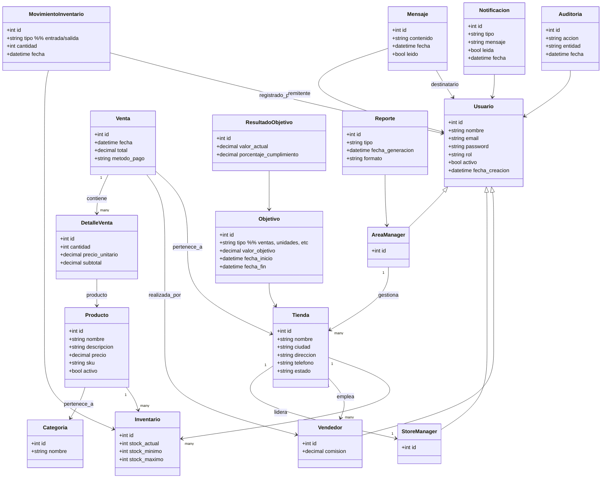

# Diagrama de Clases Completo

```mermaid
classDiagram

%% =====================
%% USUARIOS Y ROLES
%% =====================

class Usuario {
  +int id
  +string nombre
  +string email
  +string password
  +string rol
  +bool activo
  +datetime fecha_creacion
}

class AreaManager {
  +int id
}

class StoreManager {
  +int id
}

class Vendedor {
  +int id
  +decimal comision
}

Usuario <|-- AreaManager
Usuario <|-- StoreManager
Usuario <|-- Vendedor

%% =====================
%% TIENDAS
%% =====================

class Tienda {
  +int id
  +string nombre
  +string ciudad
  +string direccion
  +string telefono
  +string estado
}

AreaManager "1" --> "many" Tienda : gestiona
Tienda "1" --> "1" StoreManager : lidera
Tienda "1" --> "many" Vendedor : emplea

%% =====================
%% VENTAS
%% =====================

class Venta {
  +int id
  +datetime fecha
  +decimal total
  +string metodo_pago
}

class DetalleVenta {
  +int id
  +int cantidad
  +decimal precio_unitario
  +decimal subtotal
}

Venta "1" --> "many" DetalleVenta : contiene
DetalleVenta --> Producto : producto

Venta --> Vendedor : realizada_por
Venta --> Tienda : pertenece_a

%% =====================
%% PRODUCTOS
%% =====================

class Producto {
  +int id
  +string nombre
  +string descripcion
  +decimal precio
  +string sku
  +bool activo
}

class Categoria {
  +int id
  +string nombre
}

Producto --> Categoria : pertenece_a

%% =====================
%% INVENTARIO
%% =====================

class Inventario {
  +int id
  +int stock_actual
  +int stock_minimo
  +int stock_maximo
}

Tienda "1" --> "many" Inventario
Producto "1" --> "many" Inventario

%% =====================
%% MOVIMIENTOS DE INVENTARIO
%% =====================

class MovimientoInventario {
  +int id
  +string tipo  %% entrada/salida
  +int cantidad
  +datetime fecha
}

MovimientoInventario --> Inventario
MovimientoInventario --> Usuario : registrado_por

%% =====================
%% OBJETIVOS Y KPIs
%% =====================

class Objetivo {
  +int id
  +string tipo  %% ventas, unidades, etc
  +decimal valor_objetivo
  +datetime fecha_inicio
  +datetime fecha_fin
}

class ResultadoObjetivo {
  +int id
  +decimal valor_actual
  +decimal porcentaje_cumplimiento
}

Objetivo --> Tienda
ResultadoObjetivo --> Objetivo

%% =====================
%% REPORTES
%% =====================

class Reporte {
  +int id
  +string tipo
  +datetime fecha_generacion
  +string formato
}

Reporte --> AreaManager

%% =====================
%% COMUNICACIÓN
%% =====================

class Mensaje {
  +int id
  +string contenido
  +datetime fecha
  +bool leido
}

Mensaje --> Usuario : remitente
Mensaje --> Usuario : destinatario

%% =====================
%% NOTIFICACIONES
%% =====================

class Notificacion {
  +int id
  +string tipo
  +string mensaje
  +bool leida
  +datetime fecha
}

Notificacion --> Usuario

%% =====================
%% AUDITORÍA
%% =====================

class Auditoria {
  +int id
  +string accion
  +string entidad
  +datetime fecha
}

Auditoria --> Usuario
```

